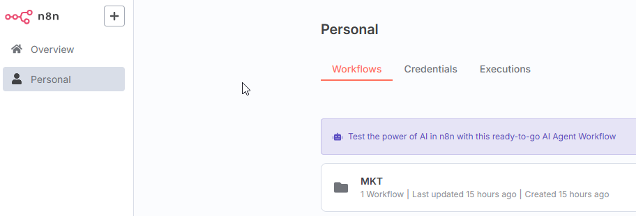
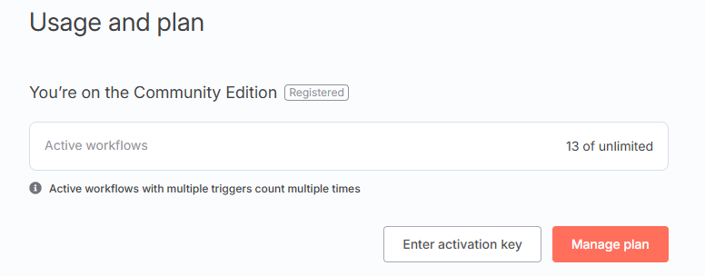
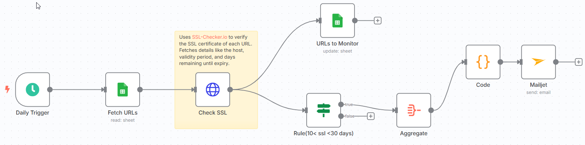

*N8N Automation Tools*
======================

## Main
This projects provide more infomation with the n8n automation tools.

## Table of Content
- [*N8N Automation Tools*](#n8n-automation-tools)
  - [Main](#main)
  - [Table of Content](#table-of-content)
  - [Implementation](#implementation)
      - [P1 - How to deploy n8n with postgresql (n8n#1)](#p1---how-to-deploy-n8n-with-postgresql-n8n1)
      - [P2 - Templates of n8n mechanism (n8n#2)](#p2---templates-of-n8n-mechanism-n8n2)
      - [P3 - Results of workflows (n8n#3)](#p3---results-of-workflows-n8n3)
      - [- Deployment Results](#--deployment-results)
      - [- Workflow Results](#--workflow-results)
      - [P4 - Hand-on technical video (n8n#4)](#p4---hand-on-technical-video-n8n4)

## Implementation
#### P1 - How to deploy n8n with postgresql (n8n#1)

You need to change some secrets in the `docker-compose.yml` before run following command.

```bash
$ docker-compose up -d
```
[Back To The Top](#table-of-content)

#### P2 - Templates of n8n mechanism (n8n#2)

[Back To The Top](#table-of-content)

#### P3 - Results of workflows (n8n#3)
#### - Deployment Results


<i>screenshot 1: the main portal screenshot</i>



<i>screenshot 2: activation screenshot</i>

#### - Workflow Results



<i>screenshot 3: SSL checking screenshot</i>

[Back To The Top](#table-of-content)

#### P4 - Hand-on technical video (n8n#4)

[Back To The Top](#table-of-content)